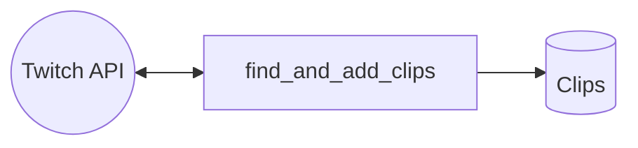
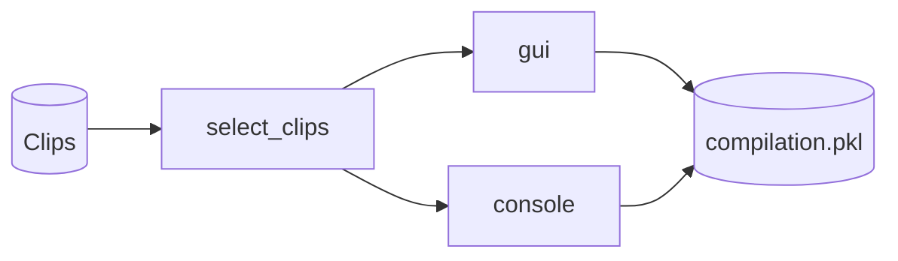
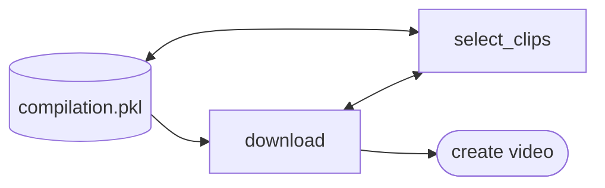
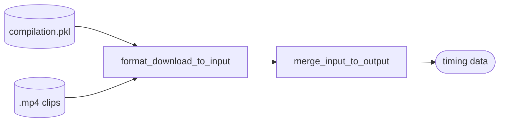
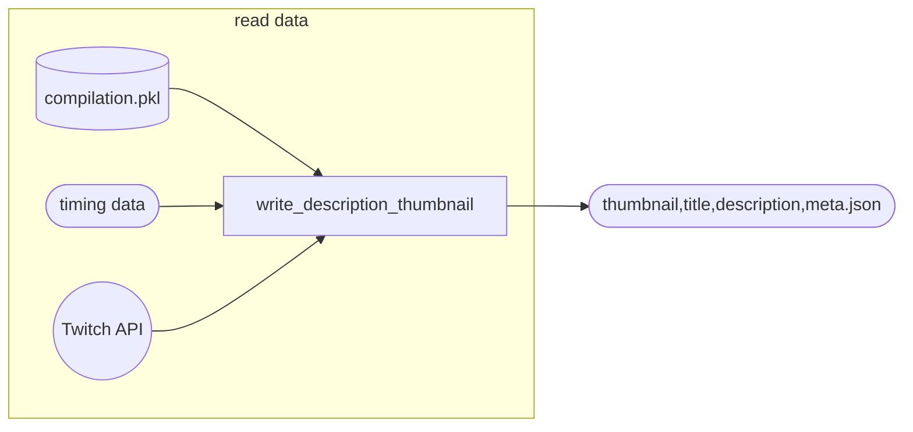
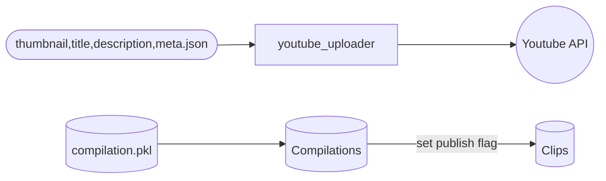
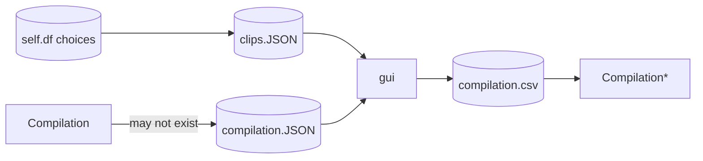

<div id="top"></div>

<!-- PROJECT LOGO -->
<br />
<div align="center">
  <a href="https://github.com/Ella36/twitch-compilation-from-cluster">
    
  </a>

  <h3 align="center">Create Twitch Compilations and Upload to Youtube</h3>
</div>

<!-- TABLE OF CONTENTS -->
<details>
  <summary>Table of Contents</summary>
  <ol>
    <li>
      <a href="#about-the-project">About The Project</a>
      <ul>
        <li><a href="#requirements">Requirements</a></li>
        <li><a href="#built-with">Built With</a></li>
        <li><a href="#resources">Resources</a></li>
      </ul>
    </li>
    <li><a href="#usage">Usage</a></li>
    <li><a href="#notes">Notes</a></li>
    <li><a href="#gui">GUI</a></li>
    <li><a href="#upload">Upload</a></li>
    <li><a href="#license">License</a></li>
  </ol>
</details>

# Twitch-Compilation-From-Cluster
Create Twitch compilations and upload to Youtube with ease.

Find clips by creators, clip ids, clip urls, game ids, category name, or a `cluster`.

A Cluster is based off Twitch Atlas (13.3MB!) 

Closely related creators can be put in a cluster defined in config file and a compilation can be made

Sample speed-up gif of output 1min video 360p mp4
see `./proj-cluster_sample_30d-1/` for example


## Built With


* [![Python][Python.org]][Python-url]
* [![Twitch][Twitch.com]][Twitch-url]
* [![Youtube][Youtube.com]][Youtube-url]
* [![Electron.js][Electron.js]][Electron-url]
* [![React][React.js]][React-url]
* [![Bootstrap][Bootstrap.com]][Bootstrap-url]

## Requirements
Python3 3.10+, lower may work

youtube-dl (pip)

pandas (pip)

[ffmpeg](https://ffmpeg.org)

[imagemagick](https://imagemagick.org)

[youtubeuploader-bin](https://github.com/porjo/youtubeuploader)

`OpenSans-Regular.ttf` or any font to draw text on video (`format_download_to_input.py`)
also see `requirements.txt`

## Resources
Twitch Atlas: https://stats.roki.sh/atlas

Youtube API: https://developers.google.com/youtube/v3/guides/uploading_a_video

Twitch API: https://dev.twitch.tv/docs/api/reference#get-clips


## Usage
There's only a few steps to create a compilation.

First make sure tables are created
Create sqlite tables with
```
./main.py --compilations
./main.py --clips
```

Choose main.py or create_compilation_from_project.py to create a compilation. Both will step through the same process. Project will set the args for you from a project config file (cfg/data.py)

At any point you can `Ctrl+C` and rerun this command. Your compilation is saved in a `*.pkl` and will be read/saved throughout.

### Main.py or create_compilation_from_project.py
set arguments manually with
```
main.py
  --clusters CLUSTERS [CLUSTERS ...]
                        clusterfile with name(s) of twitch channel (creator)
  --creators CREATORS [CREATORS ...]
                        set if list of creators
  --game_ids GAME_IDS [GAME_IDS ...]
                        set if input are game id ex 12345
  --clip_ids CLIP_IDS [CLIP_IDS ...]
                        set if input are clip id ex AwkardHelpless...
  --clip_urls CLIP_URLS [CLIP_URLS ...]
                        set if input are clip urls
  --categories CATEGORIES [CATEGORIES ...]
                        set if input is category ex 'Just Chatting'
  -co, --compilations   create table compilations
  -c, --clips           create table clips
  --sync                update published flag from compilations
  --fix-games           fix unknown game titles in db
  --confirm             autoconfirms
  --single              single URL to skip select clips and publish
  --days DAYS           pick n days
  --dir DIR             suffix to append to project to create dir
  --project PROJECT     name of project, creates working directory
  --cont                continue selection from urls.txt
  --duration DURATION   duration in seconds
  --published_ok        set to include clips that have already been published
  --lang LANG           set language ex. en, fr, es, ko
  --resolution RESOLUTION
  --skip_draw
  --title TITLE         title part before numbers ex. Twitch Compilation -->(NA)<-- #001
  --description DESCRIPTION
                        ex. Best twitch clips past 30 days!
  --youtube_category_id YOUTUBE_CATEGORY_ID
                        Gaming 20, Entertainment 24, People Blogs 22
  --playlist_title PLAYLIST_TITLE
                        Name of playlist to publish, written to JSON during title thumbnail writing
```
example
```
./main.py --project cluster_sample_30d --days 30 --duration 60 --resolution 360 --clusters cluster_sample --game_ids 509658  --description "Sample cluster clips" --youtube_category_id 24 --title Sample --dir 1 
```
or use 
` create_compilation_from_project.py `
```
./create_compilation_from_project.py --project sample_30d --dir 1
```
to set arguments from project configuration in `data.py`

### GUI

See submodule or link below
https://github.com/Ella36/gui-compilation-from-cluster

![GUI Screenshot][gui-screenshot]

### Upload
```
./youtubeuploader-bin/youtubeuploader -filename ./proj-sample_30d-1/proj-sample_30d-1.mp4 --metaJSON ./proj-sample_30d-1/meta.json -thumbnail ./proj-sample_30d-1/thumbnail_with_icon.jpg -oAuthPort 8082
```
## Setup upload
See 'setup' at https://github.com/porjo/youtubeuploader

Requires
```./client_secrets.json```

When you create the credentials in the APIs Console, make sure you select "Desktop Application"

Add yourself to test users (email)

## Notes
Set setting vars with arguments main.py or load project settings to set arg
1. Find clips

2. Create compilation by selecting clips

3. Download/Edit

4. Creating the video

5. Writing title, description, metadata

6. Updating publish and uploading


## Config file
cfg/data.py
projects: 
contains data to auto set arguments
see model/project.py

clusters:
see model/cluster.py

## Database
Clips table contains data requested by twitch API
Example table clips
|creator|url|duration|view_count|created_at|game|clipper_name|game_id|language|thumbnail_url|title|published|broken|
|-------|---|--------|----------|----------|----|------------|-------|--------|-------------|-----|---------|------|
|creator|url.tv/clip_id|24.3|5815|2021-11-08|Just Chatting|clipper|509658|en|image.jpg|title|0|0|
|creator|url.tv/clip_id2|26.0|5741|2022-01-15|Just Chatting|clipper|509658|en|image.jpg|title|0|0|

Compilations contains published clips
Example table compilations
|id|creators|urls|duration|time|project|pid|
|--|--------|----|--------|----|-------|---|
|3|c1,c2,c3,c4|url1,url2,url3,url4|633|2022-06-14|just_chatting_30d|3|

## Implementing GUI


    
## Download
youtube-dl
Stream for twitch clips
add `-f 720` options to download 720p (saves bandwidth)
```
360          mp4        360p       30fps
480          mp4        480p       30fps
720          mp4        720p       30fps
1080         mp4        1080p      30fps (best)
```

## Merge mp4
Faster to intermediate TransportStream files then concatenate to mp4
requires temporary TS file cleanup
```
ffmpeg -i "concat:fileIntermediate1.ts|fileIntermediate2.ts" -c copy -bsf:a aac_adtstoasc mergedVideo.mp4
```

## Add Text to top center of video
optional to add title text
```
ffmpeg -i input.mp4 -vf "drawtext=fontfile=/path/to/font.ttf:text='Stack Overflow':fontcolor=white:fontsize=48:box=1:boxcolor=black@0.5:boxborderw=5:x=(w-text_w)/2:y=10" -codec:a copy output.mp4
```
missing `./OpenSans-Regular.ttf` can be found here https://fontsgeek.com/fonts/Open-Sans-Regular

## Gif creation of sample video
```
ffmpeg -i input.mp4 -vf "setpts=0.2*PTS,fps=10,scale=320:-1:flags=lanczos" -c:v pam -f image2pipe - | convert -delay 10 - -loop 0 -layers optimize output.gif
```

<!-- LICENSE -->
## License

Distributed under the MIT License. See `LICENSE.txt` for more information.


 	

[Python.org]: https://img.shields.io/badge/Python-14354C?style=for-the-badge&logo=python&logoColor=white
[Python-url]: https://www.python.org/
[React.js]: https://img.shields.io/badge/React-20232A?style=for-the-badge&logo=react&logoColor=61DAFB
[React-url]: https://reactjs.org/
[Bootstrap.com]: https://img.shields.io/badge/Bootstrap-563D7C?style=for-the-badge&logo=bootstrap&logoColor=white
[Bootstrap-url]: https://getbootstrap.com
[Electron.js]: https://img.shields.io/badge/Electron-191970?style=for-the-badge&logo=Electron&logoColor=white
[Electron-url]: https://www.electronjs.org/


[Twitch.com]: 	https://img.shields.io/badge/Twitch-9146FF?style=for-the-badge&logo=twitch&logoColor=white
[Twitch-url]:    https://twitch.com
[Youtube-url]:    https://youtube.com
[Youtube.com]: https://img.shields.io/badge/YouTube-FF0000?style=for-the-badge&logo=youtube&logoColor=white
[gui-screenshot]: https://github.com/Ella36/gui-compilation-from-cluster/raw/main/screenshot.png